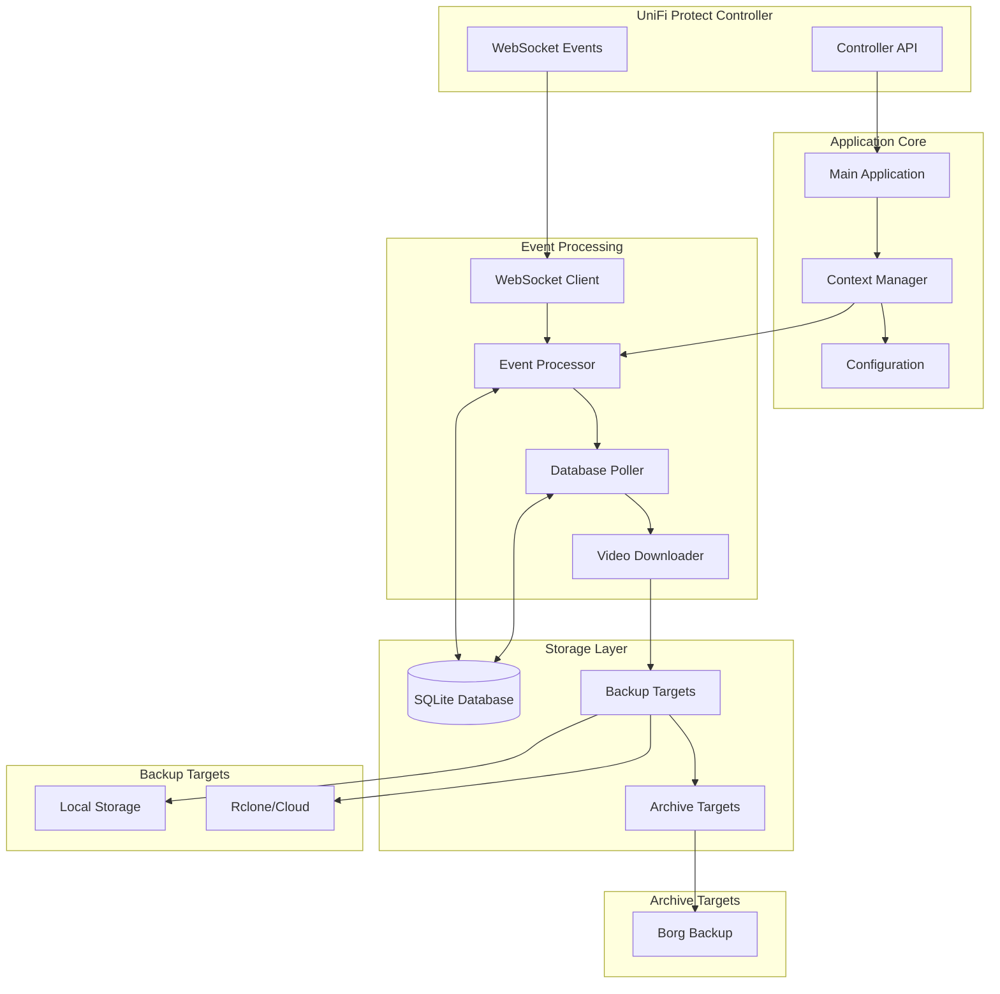
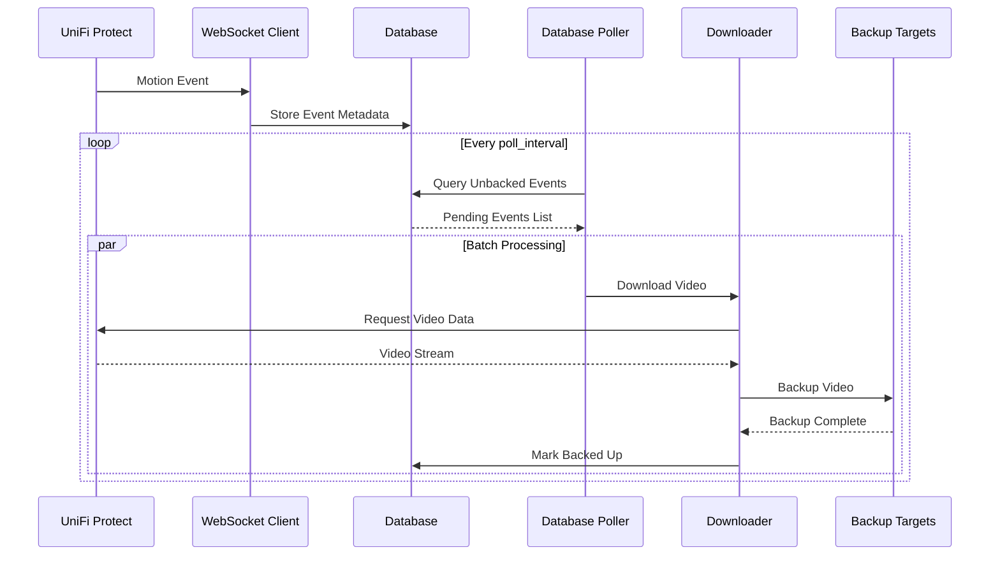
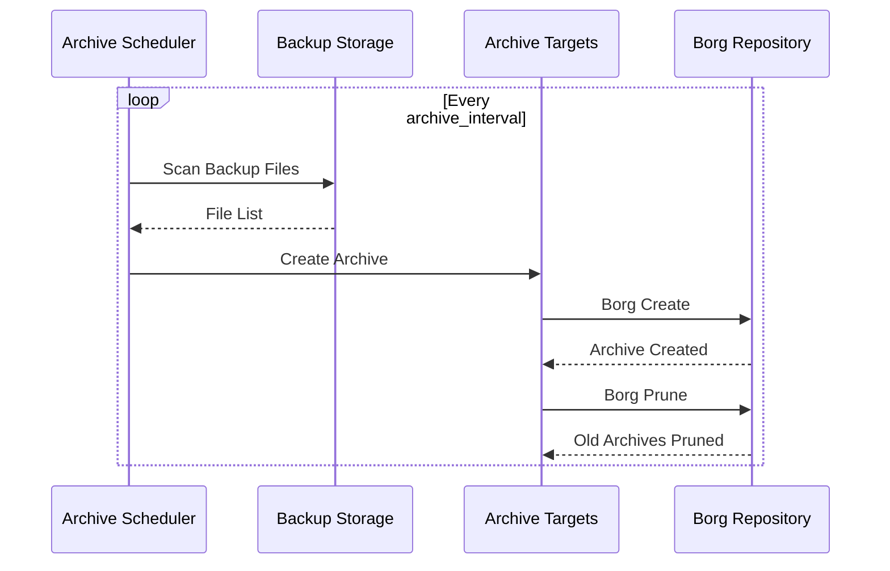

# Technical Architecture

Deep dive into the technical architecture and design principles of UniFi Protect Backup.

## Architecture Overview

UniFi Protect Backup is built using a modern, async-first architecture in Rust, designed for high performance, reliability, and concurrent processing of video events.



## Core Components

### 1. Application Context

The `Context` struct serves as the central coordination point, containing all shared resources:

```rust
pub struct Context {
    pub protect_client: ProtectClient,
    pub protect_bootstrap: Bootstrap,
    pub backup_targets: Vec<Arc<dyn Backup>>,
    pub archive_targets: Vec<Arc<dyn Archive>>,
    pub database: Database,
}
```

**Responsibilities:**
- Manages UniFi Protect API client
- Holds references to all backup and archive targets
- Provides database access
- Ensures thread-safe sharing across async tasks

### 2. Event Processing Pipeline

#### WebSocket Event Monitor
- Maintains persistent WebSocket connection to UniFi Protect
- Receives real-time event notifications
- Handles connection recovery and reconnection
- Filters events based on configuration

#### Database Poller
- Polls database for events not yet backed up
- Processes events in configurable batches (default: 10)
- Implements parallel processing within batches
- Provides backpressure control

```rust
// Batched parallel processing
for batch in pending_backup.chunks(BATCH_SIZE) {
    let batch_futures = batch.iter().map(|event| {
        let context = Arc::clone(&context);
        let event = event.clone();
        async move {
            process_event(context, event).await
        }
    });
    
    let results = join_all(batch_futures).await;
}
```

#### Video Downloader
- Streams video data from UniFi Protect
- Configurable buffer sizes for memory optimization
- Handles concurrent downloads
- Supports resume on interruption

### 3. Storage Abstraction

#### Backup Trait
Real-time backup interface for immediate storage:

```rust
#[async_trait]
pub trait Backup: Send + Sync {
    async fn backup(&self, event: &ProtectEvent, video_data: &[u8]) -> Result<String>;
    async fn prune(&self) -> Result<()>;
}
```

#### Archive Trait
Long-term archive interface for compressed, encrypted storage:

```rust
#[async_trait]
pub trait Archive: Send + Sync {
    async fn archive(&self) -> Result<String>;
    async fn prune(&self) -> Result<()>;
}
```

## Design Principles

### 1. Async-First Architecture

Everything is built on Tokio's async runtime:
- **Non-blocking I/O**: All file, network, and database operations
- **Concurrency**: Multiple events processed simultaneously
- **Resource efficiency**: Minimal thread overhead
- **Backpressure**: Controlled resource usage

### 2. Error Handling Strategy

Comprehensive error handling using `thiserror`:

```rust
#[derive(Error, Debug)]
pub enum Error {
    #[error("UniFi Protect API error: {0}")]
    Api(#[from] unifi_protect_client::Error),
    
    #[error("Database error: {0}")]
    Database(#[from] sqlx::Error),
    
    #[error("Backup error: {0}")]
    Backup(String),
    
    #[error("WebSocket error: {0}")]
    WebSocket(String),
}
```

**Error Recovery:**
- Automatic retry with exponential backoff
- Graceful degradation on storage failures
- Detailed error logging for diagnostics
- Circuit breaker patterns for external services

### 3. Configuration-Driven Design

Zero command-line arguments approach:
- All configuration via TOML files
- Environment variable overrides
- Runtime validation
- Hot-reload capabilities (planned)

### 4. Memory Management

Optimized for large video files:
- Streaming video processing
- Configurable buffer sizes
- Memory-mapped file operations where beneficial
- Careful clone management for shared data

## Data Flow

### 1. Event Detection Flow



### 2. Archive Flow



## Database Schema

### Events Table
```sql
CREATE TABLE events (
    id TEXT PRIMARY KEY,
    camera_id TEXT NOT NULL,
    camera_name TEXT NOT NULL,
    detection_type TEXT NOT NULL,
    start_time INTEGER NOT NULL,
    end_time INTEGER,
    backed_up BOOLEAN DEFAULT FALSE,
    created_at INTEGER DEFAULT (strftime('%s', 'now')),
    updated_at INTEGER DEFAULT (strftime('%s', 'now'))
);
```

### Backups Table
```sql
CREATE TABLE backups (
    id INTEGER PRIMARY KEY AUTOINCREMENT,
    event_id TEXT NOT NULL,
    target_type TEXT NOT NULL,
    target_name TEXT NOT NULL,
    file_path TEXT NOT NULL,
    file_size INTEGER,
    created_at INTEGER DEFAULT (strftime('%s', 'now')),
    FOREIGN KEY (event_id) REFERENCES events(id)
);
```

**Design Features:**
- Foreign key constraints for data integrity
- Indexes on frequently queried columns
- Timestamp tracking for audit trails
- Backup status tracking per target

## Performance Characteristics

### Concurrency Model

- **Event Processing**: Configurable batch size (default: 10 concurrent)
- **Video Downloads**: Parallel downloads with connection pooling
- **Backup Uploads**: Per-target parallelism limits
- **Database Operations**: Connection pooling with SQLite WAL mode

### Memory Usage

- **Base Memory**: ~50MB for application overhead
- **Per Event**: ~8KB metadata + configured buffer size
- **Video Buffers**: Configurable (default: 8KB per stream)
- **Database**: In-memory caching with disk persistence

### Throughput Estimates

| Scenario | Events/Hour | Concurrent Downloads | Memory Usage |
|----------|-------------|---------------------|--------------|
| Small Home | 10-50 | 1-3 | 100MB |
| Medium Business | 100-500 | 5-10 | 250MB |
| Large Installation | 1000+ | 10-20 | 500MB+ |

## Monitoring and Observability

### Structured Logging

Using `tracing` crate for structured, async-aware logging:

```rust
info!(
    event_id = %event.id,
    camera_name = %event.camera_name,
    detection_type = %event.detection_type,
    "Processing backup event"
);
```

### Metrics (Planned)

- Event processing rates
- Backup success/failure ratios
- Storage usage statistics
- Performance timing distributions

### Health Checks

- UniFi Protect connectivity
- Database accessibility
- Storage target availability
- Resource usage monitoring

## Security Architecture

### Authentication
- UniFi Protect user credentials
- SSH key authentication for remote storage
- Optional SSL/TLS verification

### Data Protection
- Encrypted archives with Borg
- Configurable encryption algorithms
- Secure credential management
- File permission enforcement

### Network Security
- HTTPS/WSS for UniFi communication
- SSH tunneling for remote storage
- Optional VPN integration
- Certificate validation

## Scalability Considerations

### Horizontal Scaling
- Multiple instances with different camera filters
- Database partitioning by time/camera
- Load balancing for high-volume installations

### Vertical Scaling
- Increased batch sizes for higher throughput
- More concurrent download streams
- Larger buffer sizes for memory-rich systems

### Storage Scaling
- Multiple backup targets for redundancy
- Tiered storage (fast/slow/archive)
- Automatic cleanup and rotation

## Extension Points

### Custom Backup Targets
Implement the `Backup` trait for new storage backends:

```rust
pub struct CustomBackup {
    config: CustomConfig,
}

#[async_trait]
impl Backup for CustomBackup {
    async fn backup(&self, event: &ProtectEvent, video_data: &[u8]) -> Result<String> {
        // Custom implementation
    }
    
    async fn prune(&self) -> Result<()> {
        // Custom cleanup logic
    }
}
```

### Custom Archive Targets
Implement the `Archive` trait for new archive backends:

```rust
pub struct CustomArchive {
    config: CustomArchiveConfig,
}

#[async_trait]
impl Archive for CustomArchive {
    async fn archive(&self) -> Result<String> {
        // Custom archival logic
    }
    
    async fn prune(&self) -> Result<()> {
        // Custom retention logic
    }
}
```

## Future Architecture Enhancements

### Planned Features
- **Plugin System**: Dynamic loading of custom targets
- **Distributed Processing**: Multi-node event processing
- **Real-time Analytics**: Event pattern analysis
- **ML Integration**: Smart event filtering
- **Web UI**: Management dashboard
- **API Server**: REST API for external integration

### Performance Optimizations
- **Zero-copy Video Processing**: Eliminate unnecessary data copying
- **Custom Protocol**: Optimized UniFi Protect communication
- **Memory-mapped Storage**: Direct file system integration
- **GPU Acceleration**: Hardware-accelerated video processing