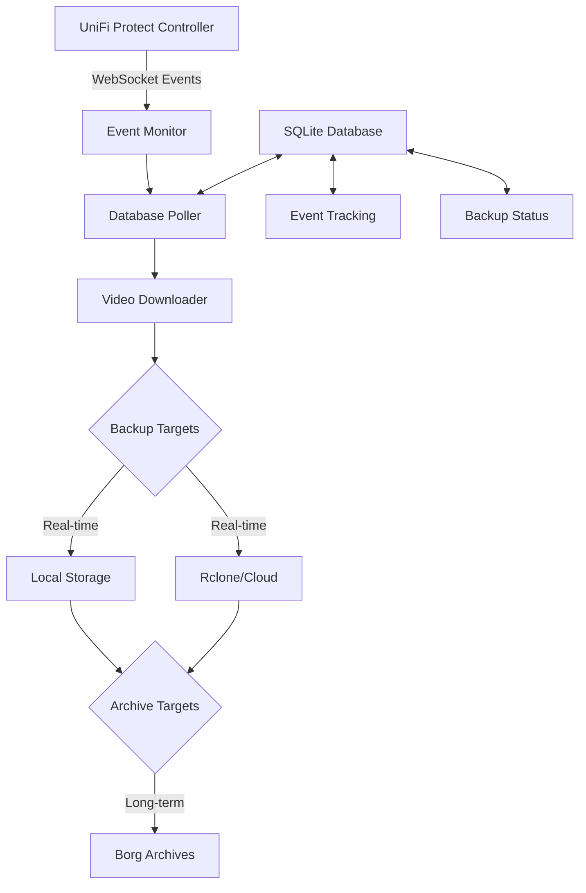

# UniFi Protect Backup (Rust Edition)

A high-performance backup tool that monitors UniFi Protect events via WebSocket and backs up video clips to multiple storage backends with support for real-time processing, deduplication, and encryption.

## Overview

UniFi Protect Backup (Rust Edition) is designed to provide reliable, real-time backup of your UniFi Protect video surveillance footage. Built in Rust for maximum performance and safety, it offers a **config-only approach** with no command line arguments - all configuration is handled through `config.toml` and environment variables.

## Key Features

### 🚀 **Real-time Event Processing**
- WebSocket connection to UniFi Protect for instant event detection
- Batched parallel processing for high throughput
- Configurable detection types (motion, person, vehicle, etc.)

### 💾 **Multiple Storage Backends**
- **Local Filesystem**: Direct file storage with configurable paths
- **Rclone**: Cloud storage integration (S3, Google Drive, etc.)
- **Borg Archives**: Encrypted, deduplicated long-term storage

### ⚡ **High Performance**
- Async-first architecture built on Tokio
- Parallel uploads and downloads
- Streaming video processing
- Connection pooling and buffer optimization

### 🔒 **Security & Reliability**
- Comprehensive error handling with structured error types
- SSL/TLS verification options
- SSH key authentication for remote storage
- Environment variable and file-based secret management

### 🗄️ **Database Tracking**
- SQLite database with proper foreign key constraints
- Event metadata tracking
- Backup status monitoring
- Retention policy enforcement

## Architecture



## Quick Start

1. **Install** the application (see [Installation Guide](installation.md))
2. **Configure** your setup using the interactive config builder
3. **Run** the application - it will automatically detect and backup new events

```bash
# Interactive configuration setup
unifi-protect-backup-rs

# Or with existing config
unifi-protect-backup-rs --config /path/to/config.toml
```

## Configuration Highlights

The application uses a hierarchical configuration system:

- **UniFi Connection**: WebSocket monitoring of your UniFi Protect controller
- **Backup Targets**: Real-time storage (local, cloud)
- **Archive Targets**: Long-term storage (Borg)
- **Event Processing**: Detection types, retention policies, file organization

Example configuration:

```toml
[unifi]
address = "192.168.1.100"
username = "backup-user"
password = "env:UNIFI_PASSWORD"

[backup]
retention-period = "30d"
poll-interval = "30s"
detection-types = ["motion", "person", "vehicle"]

[[backup.remote]]
local = { path-buf = "./data" }

[archive]
archive-interval = "1d"
retention-period = "365d"

[[archive.remote]]
borg = { borg-repo = "user@rsync.net:unifi-protect" }
```

## Use Cases

### 🏠 **Home Users**
- Backup important motion events to local NAS
- Archive to cloud storage for offsite backup
- Retain critical footage beyond UniFi Protect's limits

### 🏢 **Small Business**
- Multi-site backup with centralized storage
- Compliance retention policies
- Encrypted offsite archives

### 🏭 **Enterprise**
- High-throughput event processing
- Multiple redundant storage targets
- Integration with existing backup infrastructure

## Next Steps

- [Installation Guide](installation.md) - Get up and running
- [Configuration Reference](configuration.md) - Detailed configuration options
- [Architecture Overview](architecture.md) - Technical deep dive
- [Usage Guide](usage.md) - Operating and monitoring the application

---

!!! info "Performance Note"
    This Rust edition provides significant performance improvements over script-based solutions, with async processing, connection pooling, and optimized memory usage for handling large video files and high event volumes.